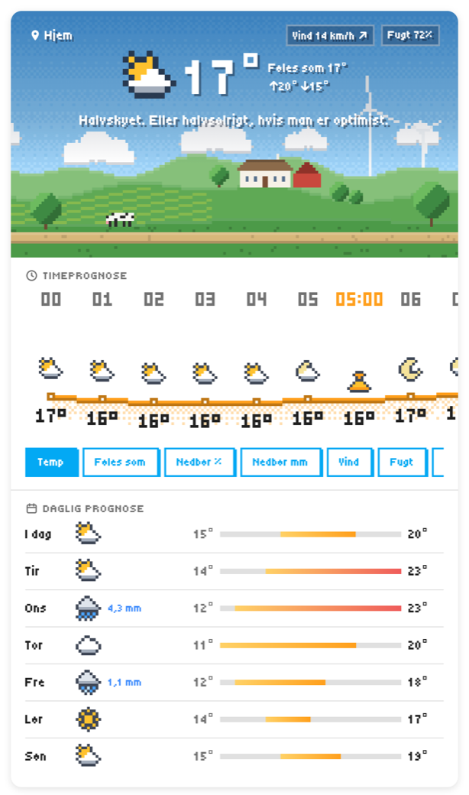
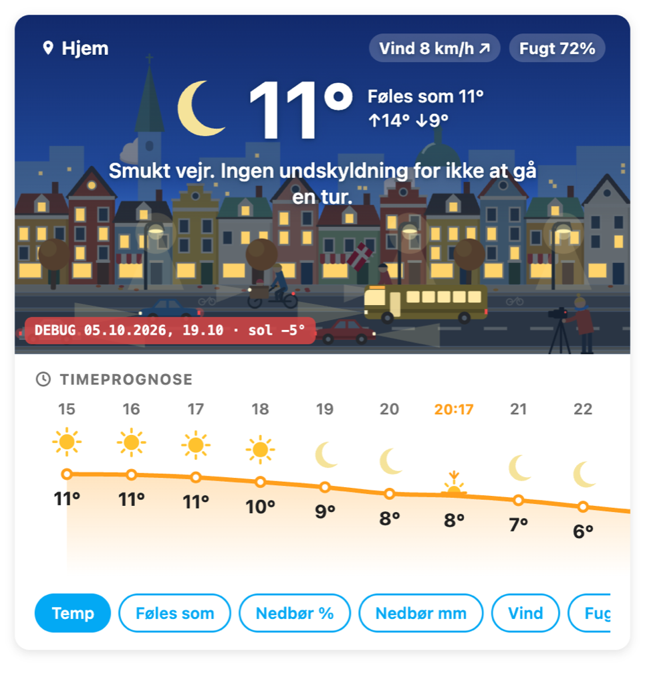
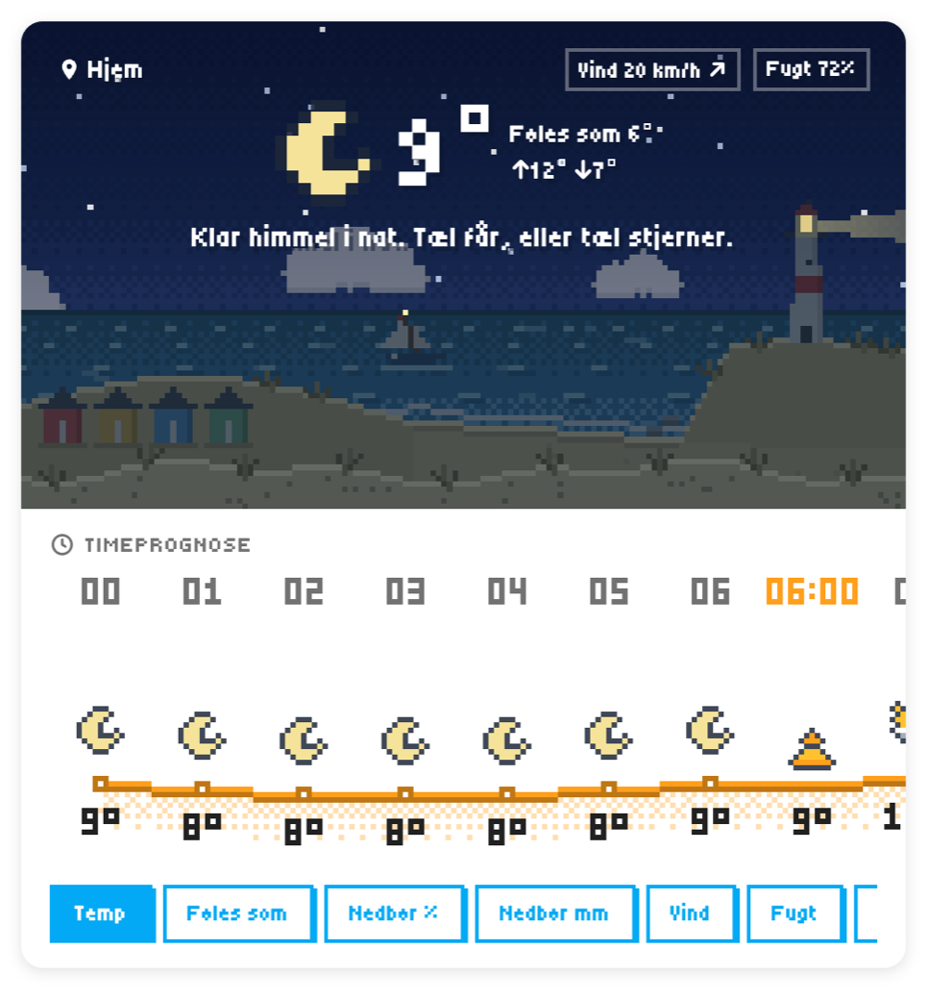
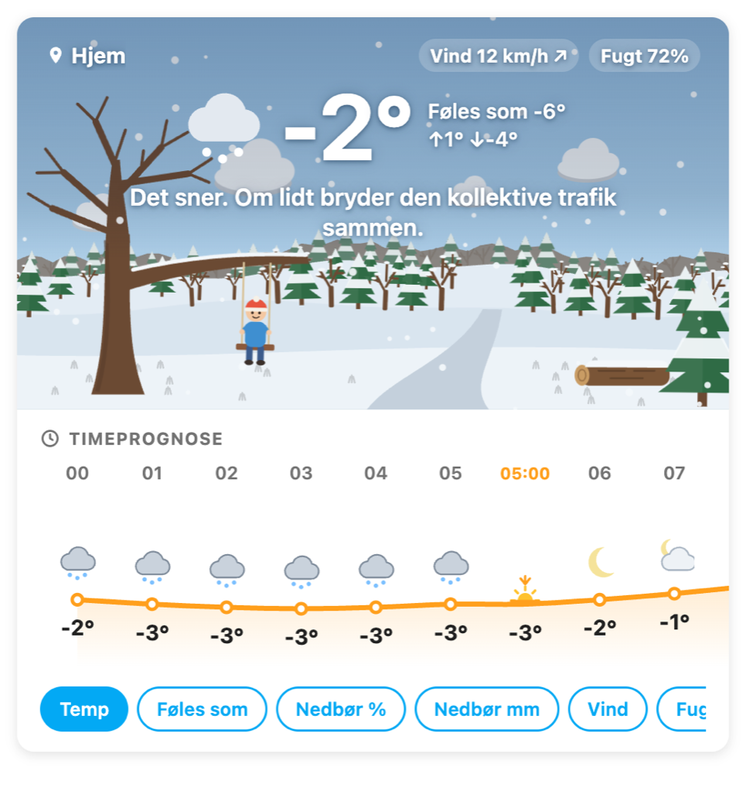

# Cabbage Weather 🥬

A playful, illustrated weather card for Home Assistant, inspired by Carrot Weather.

<p>
  
  
</p>
<p>
  
  
</p>

The top of the card is a little animated landscape that reacts to the weather:

- Rain, snow, sleet, hail, fog and lightning appear when they happen.
- Wind makes trees sway, wind turbines spin faster and leaves blow by.
- The sky follows the sun (dawn, day, dusk, night), and the ground and trees follow the seasons.
- The current temperature and a cheeky Danish comment sit on top.

Below the scene:

- An hourly chart where the weather icons ride the temperature curve, with sunrise and sunset marked.
- An optional daily forecast.

**Scenes:** Forest · Rural · Suburb · City · Seaside
**Art styles:** Pixel art (default) · Flat vector

## Install

### HACS (recommended)

1. HACS → ⋮ → **Custom repositories** → add `https://github.com/mkjeldsen/haos-cabbage-weather`, category **Dashboard**.
2. Install **Cabbage Weather**, then reload the browser.

### Straight from the CDN (any install, no file access needed)

Works on every install type, including Home Assistant Container. Turn on *Advanced mode* in your profile, then go to
Settings → Dashboards → ⋮ → **Resources** and add this URL as a *JavaScript module*:

```
https://cdn.jsdelivr.net/gh/mkjeldsen/haos-cabbage-weather@v0.1.2/dist/cabbage-weather-card.js
```

To update, change the version in the URL to the newest [release](https://github.com/mkjeldsen/haos-cabbage-weather/releases).

### Manual

1. Download `cabbage-weather-card.js` from the latest [release](https://github.com/mkjeldsen/haos-cabbage-weather/releases) (or `dist/`), and copy it to `/config/www/`.
2. Settings → Dashboards → ⋮ → **Resources** → add `/local/cabbage-weather-card.js` as a *JavaScript module*.

## Configure

Add the card from the dashboard editor (search for "Cabbage Weather"). All options are available in the visual editor. In YAML:

```yaml
type: custom:cabbage-weather-card
entity: weather.forecast_home
name: Hjem            # optional, defaults to the entity name
scene: rural          # forest | rural | suburb | city | seaside
style: pixel          # pixel | flat
animations: true
easter_eggs: true
show_snark: true
show_hourly: true
hours: 24             # 6–48
show_daily: false
days: 7               # 3–10
metrics:              # chart tabs, in this order; tabs without data are hidden
  - temperature
  - feels_like
  - precipitation_probability
  - precipitation
  - wind
  - humidity
  - cloud_coverage
  - uv_index
sun_entity: sun.sun
```

Tapping the scene opens the weather entity's more-info dialog.

### Weather provider

The card works with any Home Assistant `weather.*` entity that provides forecasts. It was built against **met.no** (the default integration). With met.no:

- **Feels like:** met.no has no apparent temperature, so the card calculates it (wind chill when cold, heat index when hot and humid).
- **Precipitation chance:** usually empty for Nordic locations, so that tab hides itself.

**Open-Meteo** (free, no account) also works and provides a real feels-like temperature.

## Pixel art vs flat vector

|                | Pixel art (default) | Flat vector |
|----------------|---------------------|-------------|
| Rendering      | JavaScript, 160×88 canvas, ~15 fps | SVG + CSS animations |
| CPU            | A little, continuously while visible (pauses off-screen / hidden tab) | Near zero |
| Font           | Tiny5, loaded from Google Fonts (falls back to monospace offline) | Your dashboard font |
| Sharpness      | Crispest at card widths that are multiples of 160 px | Crisp at any size |

On low-powered wall tablets, choose flat vector or turn animations off. Animations also stop automatically when the device has *reduce motion* enabled.

## Easter eggs

Every few minutes, if easter eggs are on, something unusual may pass through the scene: a UFO, a hot-air balloon or a cat. Impatient? Open the browser console on your dashboard and run:

```js
cabbageWeather.egg('ufo')   // or 'balloon', 'cat', or no argument for a surprise
```

A few days of the year are a little more special. We won't spoil which.

## Development

```bash
npm install
npm run dev        # rollup watch: dist/ + dev harness
python3 -m http.server 5187
```

- `http://localhost:5187/dev/` is the card against a mock Home Assistant. Switch condition, temperature, wind, sun elevation, month and scene there.
- `http://localhost:5187/dev/scene-lab.html` shows every scene in both styles under any weather, time and season.

`npm run build` produces the minified `dist/cabbage-weather-card.js`. Publishing a GitHub release builds the card and attaches it to the release automatically.

### Adding a scene

A scene is a pair of files: `src/scenes/flat/<id>.ts` (returns SVG markup) and `src/scenes/pixel/<id>.ts` (draws on a canvas). The engines take care of the sky, clouds, weather effects and easter eggs; a scene only draws land and props, using the shared palette so night, dusk, seasons and snow work automatically. `rural.ts` is the reference implementation.

## License

MIT
